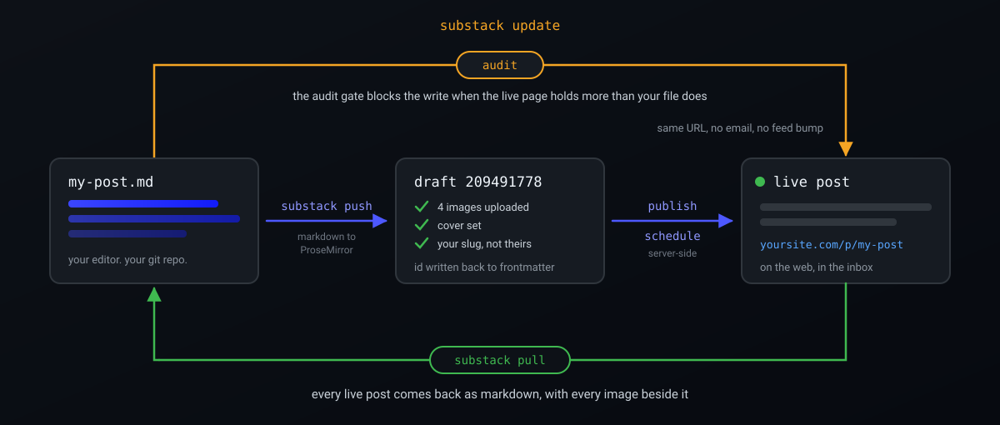
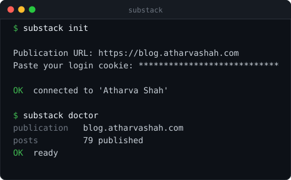
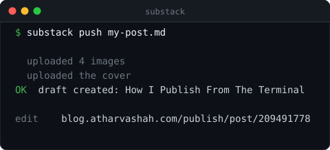
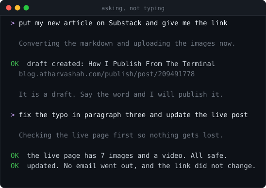

<div align="center">


# substack-cli

**Markdown in. Live newsletter out.**

A command line client for [Substack](https://substack.com), built so your coding agent can
run your newsletter for you. Push, pull, schedule, and publish without opening the web
editor.

[](LICENSE)
[](https://www.python.org/)
[](pyproject.toml)
[](docs/agents.md)
[](https://github.com/HighnessAtharva/substack-cli/actions)
[](https://github.com/HighnessAtharva/substack-cli/stargazers)

[Quickstart](#ship-a-post-in-three-commands) · [Agents](#hand-it-to-your-agent) · [What it does](#the-twelve-jobs-it-does) · [Commands](#every-command) · [Docs](docs/) · [Why](#substack-has-no-api-so-i-wrote-one)



<sub>Your markdown file is the source of truth. Substack is a render target.</sub>

</div>

---

## Ship a post in three commands

```bash
pipx install git+https://github.com/HighnessAtharva/substack-cli
substack init
substack push my-post.md
```

<div align="center">

</div>

> [!NOTE]
> Setup asks for two things. Your publication URL, and the `connect.sid` cookie from a
> browser where you are already logged in. The publication id and the user id get read off
> the API and cached for you. [docs/authentication.md](docs/authentication.md) shows exactly
> where that cookie lives.

A post is a markdown file with frontmatter on top.

```markdown
---
title: How I Publish From The Terminal
subtitle: One command, no web editor
slug: how-i-publish-from-the-terminal
cover: cover.png
---

Your article body, in plain markdown.
```

One command ships it, images and cover included.

```bash
substack push my-post.md
```

<div align="center">

</div>

The draft id lands back in your frontmatter. Your next push updates that same draft instead
of creating a second one. When the draft reads right, take it live.

```bash
substack publish 209491778 --yes --no-email
```

## Hand it to your agent

I did not build this to type commands. I built it so Claude Code could run my Substack while
I wrote. Three lines and yours can too.

```bash
pipx install git+https://github.com/HighnessAtharva/substack-cli
substack init            # paste your publication URL and one cookie
substack agent install   # your agent learns the tool
```

Then talk to it in English.

<div align="center">

</div>

```
"what Substack drafts do I have?"
"push posts/how-i-publish.md as a draft and give me the link"
"fix the typo in paragraph three of my last post and update it live"
"back up my whole Substack archive into ./archive and commit it"
"schedule Tuesday's draft for 9am, no email"
```

`agent install` writes the instruction file your agent already reads. It detects which agent
you use, and it never clobbers rules you already have.

| Agent | File it writes |
|---|---|
| Claude Code, Claude Desktop | `.claude/skills/substack-cli/SKILL.md` |
| Cursor | `.cursor/rules/substack-cli.mdc` |
| Codex, Gemini CLI, Aider, Cline | `AGENTS.md` |

That file is the part that matters. It carries the operating knowledge that stops an agent
doing damage. Seven hard rules, the safe edit loop, the exit codes, and six worked recipes. It
also documents the two-bodies trap, where a push to a live post silently does nothing. Read the
file with `substack agent print`, or in [docs/agents.md](docs/agents.md).

> [!TIP]
> Every write gates on one machine-readable check. `substack audit post.md --json` returns
> `{"clean": true, "destroyed": {}, ...}`, and `clean` is the whole decision. An agent that
> respects that field cannot delete your work.

> [!WARNING]
> Scheduling a **post** is real and server-side. It needs a second cookie, saved once with
> `substack init --hub-token`. Scheduling a **Note** is impossible, because Substack has no
> endpoint for it. Your agent will offer to schedule the command instead. That means a Claude
> Code routine, a `cron` entry, or a Task Scheduler job that runs `substack note` on time.

## The twelve jobs it does

<table>
<tr>
<td width="33%" valign="top">

**Push**

A markdown file becomes a Substack draft. Headings, bold, links, code blocks, lists, quotes and captions all convert.

</td>
<td width="33%" valign="top">

**Pull**

A live post comes back down as markdown. Every image downloads next to it.

</td>
<td width="33%" valign="top">

**Update**

You rewrite an already published post in place. No email, no feed bump, same URL.

</td>
</tr>
<tr>
<td valign="top">

**Audit**

You see exactly what an update would destroy, before it destroys anything.

</td>
<td valign="top">

**Publish**

You go live now, with or without emailing your subscribers.

</td>
<td valign="top">

**Schedule**

You set a real server-side release time, and you cancel it the same way.

</td>
</tr>
<tr>
<td valign="top">

**Notes**

You post a Substack Note from a file or a string, with image attachments.

</td>
<td valign="top">

**Covers**

The hero image uploads itself. `cover` swaps it on a live post and leaves the text alone.

</td>
<td valign="top">

**Slugs**

Your file owns the public URL. Substack never gets to invent a truncated one.

</td>
</tr>
<tr>
<td valign="top">

**Tables**

A markdown table renders to a PNG, because the Substack editor has no table support.

</td>
<td valign="top">

**Templates**

You list the saved post templates on your account and push a file against one.

</td>
<td valign="top">

**Sitemap**

You build a local index of every live post, ready to commit beside your drafts.

</td>
</tr>
</table>

It runs on the Python standard library alone. No dependencies to install, no API key to
request, no browser to automate, and no Node runtime anywhere. Pillow is the one optional
extra, and only if you want tables rendered.

## The command that stops you losing work

> [!CAUTION]
> `update` regenerates a live post's body from your markdown. Anything on the page that your
> markdown does not mention is gone, with no undo and no warning in the output. On my own
> publication that would have silently deleted 125 images, 24 captions, 9 embeds, 2 videos
> and 2 pullquotes across 33 posts.

So `audit` runs first. It compares the live page against what your file would produce. It exits
non-zero when the update would lose something.

<div align="center">

</div>

Some blocks live only in the editor and markdown cannot express them. That covers YouTube
embeds, uploaded video, Twitter embeds, callouts and pullquotes. `update` extracts them from
the live body and re-anchors each one after the same paragraph it followed. Rewriting the text
around them does not lose them.

## Every command

<div align="center">

</div>

<details>
<summary><b>All 22 commands, with what each one does</b></summary>

<br>

| Command | What it does |
|---|---|
| `substack init` | Save credentials and verify them. |
| `substack agent install` | Teach Claude Code, Cursor, or any agent to drive this. |
| `substack doctor` | Check auth and print the resolved configuration. |
| `substack list [--published]` | List drafts, or live posts. |
| `substack get <id\|slug>` | Print one post's metadata. |
| `substack push <file>` | Create or update a draft from markdown. |
| `substack update <file> --yes` | Rewrite a live post. No email, no feed bump. |
| `substack audit <file> [--json]` | Report what an update would destroy. |
| `substack cover <id> --image X` | Swap a post's hero image, body untouched. |
| `substack pull <id\|slug>` | Download a live post as markdown plus images. |
| `substack pull --published` | Download the entire archive. |
| `substack render <file>` | Convert to ProseMirror JSON offline. Sends nothing. |
| `substack publish <id> --yes` | Publish now. `--no-email` puts it on the web quietly. |
| `substack unpublish <id> --yes` | Take a live post back to draft. |
| `substack schedule <id> --at "..."` | Real server-side scheduled release. |
| `substack unschedule <id>` | Cancel it. |
| `substack set <id> --title --subtitle --slug` | Change metadata in place. |
| `substack delete <id>` | Delete a draft. Refuses published posts. |
| `substack note "text"` | Post a Substack Note. |
| `substack note-delete <id>` | Delete one of your Notes. |
| `substack templates` | List the saved post templates on your account. |
| `substack sitemap` | Build a local index of every live post. |

</details>

Full reference with every flag: [docs/commands.md](docs/commands.md).

## Substack has no API, so I wrote one

No public API, no official CLI, and no `git push` for a newsletter. Everything runs through a
web editor that owns your content, your formatting, and your workflow. You cannot draft in
your own editor, keep posts in version control, run a linter over them, or script a publish.

| The web editor | substack-cli |
|---|---|
| You draft in a browser text box | You draft in your own editor |
| Substack picks the URL slug | Your frontmatter picks the slug |
| Version history you cannot read | Every change is a git commit |
| Publishing is a click, by hand | Publishing is a command, in CI |
| Your archive sits on their server | `pull` writes the archive to your disk |
| Nothing can lint a draft first | Any script runs before the push |

The tools that do exist read Substack. They fetch feeds and scrape archives. Almost none of
them write, and the ones that try break the moment Cloudflare sees a `curl` User-Agent.

This one writes. It has published 79 posts to a real newsletter since July 2024. Every rule it
enforces exists because something went wrong on a live page first.

<div align="center">
<a href="https://blog.atharvashah.com"></a>
<br>
<sub><a href="https://blog.atharvashah.com">blog.atharvashah.com</a> runs on this. Every post, cover, and schedule.</sub>
</div>

## What people do with it

**An agent runs the whole pipeline.** You write the article, then your agent converts it,
uploads the images, audits the live page, and hands back a link. See
[docs/agents.md](docs/agents.md).

**Your newsletter lives in version control.** Keep every post in a git repo, review changes in
a pull request, and push the merged file to Substack.

**Everything gets backed up.** `substack pull --published -o ./archive` writes every live post
to markdown with its images alongside. Run it on a cron and you own a real copy.

**A whole blog migrates in.** Point `push` at the markdown you already keep in Hugo, Jekyll,
Obsidian, or a Notion export. The archive moves across without you touching the editor.

**CI drives the pipeline.** Lint, spell-check, score, or run a model pass over a file, then
push and schedule it. Every command is scriptable and exits non-zero on failure.

## Nothing destructive happens by accident

- `publish`, `update`, and `unpublish` all refuse to run without `--yes`, and each one prints
  what it is about to do first.
- `delete` refuses published posts outright and tells you to `unpublish` first.
- `update` prints its destroy list before it touches anything, and `audit` exits 1 when the
  local file is not a superset of the live page.
- `render` converts offline and sends nothing, so an agent checks its own work before any
  write reaches the network.
- Your cookies live in a `0600` config file or in environment variables, and nothing ever
  prints them back.

## Where to read more

<details>
<summary><b>Ten guides, one per job</b></summary>

<br>

| Guide | What it covers |
|---|---|
| [agents.md](docs/agents.md) | Let Claude Code, Cursor, or Codex run your Substack. |
| [installation.md](docs/installation.md) | Every install path, Windows included. |
| [authentication.md](docs/authentication.md) | Where the two cookies live and how long they last. |
| [commands.md](docs/commands.md) | Complete reference, every flag, every exit code. |
| [frontmatter.md](docs/frontmatter.md) | Every field the tool reads and writes. |
| [markdown.md](docs/markdown.md) | What converts, what does not, and why. |
| [workflows.md](docs/workflows.md) | Git-backed publishing, backups, migrations, CI. |
| [api-notes.md](docs/api-notes.md) | The undocumented Substack API, written down. |
| [troubleshooting.md](docs/troubleshooting.md) | Every error message and its fix. |
| [faq.md](docs/faq.md) | Is this allowed, will it break, what about paid posts. |

</details>

## Contributing

Issues and pull requests are welcome. The test suite is 122 offline checks that run in under a
second, and every one of them pins a bug that reached a live newsletter.

```bash
git clone https://github.com/HighnessAtharva/substack-cli
cd substack-cli
pip install -e ".[dev]"
pytest -q && ruff check .
```

Read [CONTRIBUTING.md](CONTRIBUTING.md) first.

## Who made this

**Atharva Shah**, who publishes at [blog.atharvashah.com](https://blog.atharvashah.com) and
uses this to do it.

<div align="center">

[](https://atharvashah.com)
[](https://blog.atharvashah.com)
[](https://github.com/HighnessAtharva)
[](https://www.linkedin.com/in/atharva-shah-tech/)
[](https://x.com/cultist_dev)

</div>

If this saved you an afternoon, a star helps other writers find it.

## Legal

MIT licensed. Not affiliated with, endorsed by, or supported by Substack Inc. It drives the
same private endpoints your browser does, using your own session cookie, against your own
publication. Read [docs/faq.md](docs/faq.md) before you build a business on it.

---

<div align="center">
<sub>

**Keywords**: substack api · substack cli · publish to substack from markdown ·
substack markdown import · substack automation · substack python client ·
newsletter as code · substack backup · export substack posts · substack scheduler ·
claude code substack skill · agent publishing tools · AGENTS.md

</sub>
</div>
